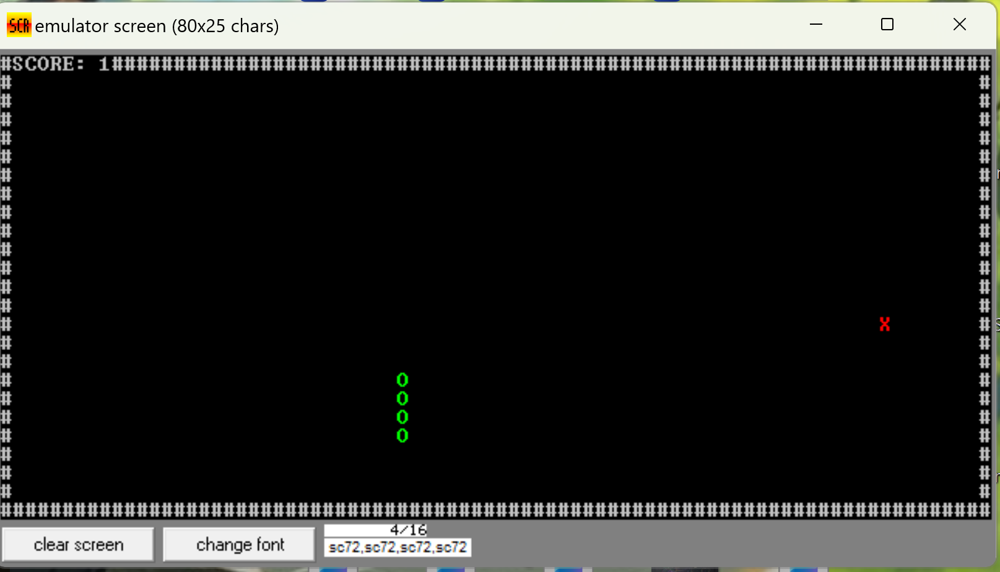

# 🐍 Snake Game — Assembly 8086

لعبة Snake بسيطة وممتعة مكتوبة بلغة *Assembly 8086*  
تم تنفيذها كمشروع جماعي بهدف فهم التحكم في الشاشة وحركة العناصر باستخدام مقاطعات الـ BIOS والـ DOS.

---

## 👩‍💻 Team Members
- *Samah Mohamed Salah*
- *Sahar Osama El-saied*
- *Sahar Reda Helmy*

---

## 🎮 Demo

### ▶ Gameplay Video  
لتشغيل اللعبة مباشرة من الفيديو المرفوع في الريبو:  
[شاهد الفيديو](demo/UntitledVideo.mp4)

---

## 🖼 Screenshots
شاهد لقطات للعبة أثناء التشغيل:  

---

## 🧩 Features
- حركة الثعبان باستخدام الأسهم  
- زيادة طول الذيل عند أكل الطعام  
- طعام يظهر بشكل عشوائي  
- كشف التصادم مع الجدران أو الذيل  
- العمل على EMU8086 أو DOSBox  
- واجهة Text Mode بسيطة وسريعة

---

## 🛠 How to Run

### ▶ تشغيل على EMU8086
1. افتح EMU8086  
2. اعمل Load لملف Snake.asm (الموجود خارج فولدر demo)  
3. اضغط Assemble  
4. اضغط Run

### ▶ تشغيل على DOSBox
1. ضع ملف Snake.exe أو جمّعي الكود باستخدام MASM/TASM  
2. افتح DOSBox  
3. اكتب:

mount c <path_to_your_project_folder>
c:
snake.exe

---

## 📂 Project Structure

Snake-Game/
│
├── Snake.asm
│
├── demo/
│   ├── Screenshot1.png
│   ├── Screenshot2.png
│   ├── Screenshot3.png
│   ├── Screenshot4.png
│   └── UntitledVideo.mp4
│
└── README.md

---

## ⭐ Notes
- اللعبة تعمل في وضع النص (Text Mode)  
- استخدام مقاطعات BIOS مثل int 10h للرسم  
- واستخدام int 16h للوحة المفاتيح  
- مساحة الذاكرة بسيطة جدًا ومناسبة لـ 8086

---

## ❤ Credits
مشروع تم تنفيذه بتعاون 3 طلاب:
- Samah Mohamed 
- Sahar Osama  
- Sahar Reda  

لو المشروع عجبك… اضغط ⭐ على الريبو ❤
